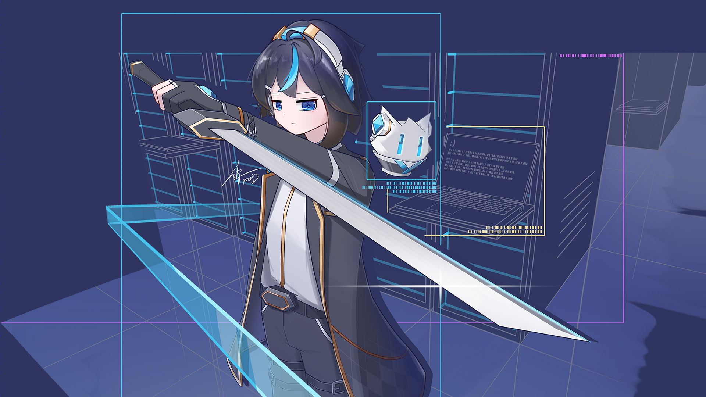

<picture>
  <source
    type="image/avif"
    srcset="images/avif/banner.avif"
  >
  <source
    type="image/webp"
    srcset="images/webp/banner.webp"
  >
  
</picture>

<picture>
  <source
    type="image/avif"
    media="(prefers-color-scheme: light)"
    srcset="images/avif/stickers/thumb-light.avif"
  >
  <source
    type="image/avif"
    media="(prefers-color-scheme: dark)"
    srcset="images/avif/stickers/thumb-dark.avif"
  >
  <source
    type="image/webp"
    media="(prefers-color-scheme: light)"
    srcset="images/webp/stickers/thumb-light.webp"
  >
  <source
    type="image/webp"
    media="(prefers-color-scheme: dark)"
    srcset="images/webp/stickers/thumb-dark.webp"
  >
  <source
    type="image/jpeg"
    media="(prefers-color-scheme: light)"
    srcset="images/jpg/stickers/thumb-light.jpg"
  >
  <source
    type="image/jpeg"
    media="(prefers-color-scheme: dark)"
    srcset="images/jpg/stickers/thumb-dark.jpg"
  >
  
</picture>

- 🌐 中文 / English
- 🗣 Pronunciation: /stiːv ɕy/. You can also call me "什五 (shí wǔ, ㄕˊ ㄨˇ or ジュウゴ)".
- 👤 He/Him. Virgo. MBTI personality: ISTP.
- 🖌 I'm an amateur creator. I draw something and make video sometimes.
- 💾 Sometimes I code. Currently in production: [Quanto Series](https://stevehsudrawing.github.io/softwares.html#quanto-series)
- 🤔 I want to create more, code more and sleep more.
- 🎨 My major color: `#47c4ee`, `#3c96ff`

---

  <a href="https://x.com/stevehsudrawing">
    <picture>
      <source
        type="image/avif"
        srcset="images/avif/icons/x-twitter.avif"
      >
      <source
        type="image/webp"
        srcset="images/webp/icons/x-twitter.webp"
      >
      
    </picture>
  </a>
  <a href="https://www.pixiv.net/users/70732361">
    <picture>
      <source
        type="image/avif"
        srcset="images/avif/icons/pixiv.avif"
      >
      <source
        type="image/webp"
        srcset="images/webp/icons/pixiv.webp"
      >
      
    </picture>
  </a>
  <a href="https://www.deviantart.com/stevehsudrawing">
    <picture>
      <source
        type="image/avif"
        srcset="images/avif/icons/deviant-art.avif"
      >
      <source
        type="image/webp"
        srcset="images/webp/icons/deviant-art.webp"
      >
      
    </picture>
  </a>
  <a href="https://space.bilibili.com/298733903">
    <picture>
      <source
        type="image/avif"
        srcset="images/avif/icons/bilibili.avif"
      >
      <source
        type="image/webp"
        srcset="images/webp/icons/bilibili.webp"
      >
      
    </picture>
  </a>
  <a href="https://stevehsudrawing.github.io/">
    <picture>
      <source
        type="image/avif"
        srcset="images/avif/icons/steve-hsu.avif"
      >
      <source
        type="image/webp"
        srcset="images/webp/icons/steve-hsu.webp"
      >
      
    </picture>
  </a>
   
  Thanks for your visiting!

