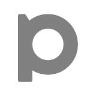
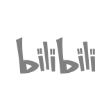



<picture>
  <source media="(prefers-color-scheme: light)" srcset="images/character_light.png">
  <source media="(prefers-color-scheme: dark)"  srcset="images/character_dark.png">
  
</picture>

- 🌐 EN / 中文
- 👤 Pronunciation: /stiːv ɕy/. You can also call me "什五 (shí wǔ or ジュウゴ)".
- 🎨 I'm an amateur creator. I draw something and make video sometimes.
- 💾 Sometimes I code. Currently in production: [Quanto Series](https://stevehsudrawing.github.io/softwares.html#quanto-series)
- 🤔 I want to create more, code more and sleep more.

---

  
  
  
  
  
   
  Thanks for your visiting!

