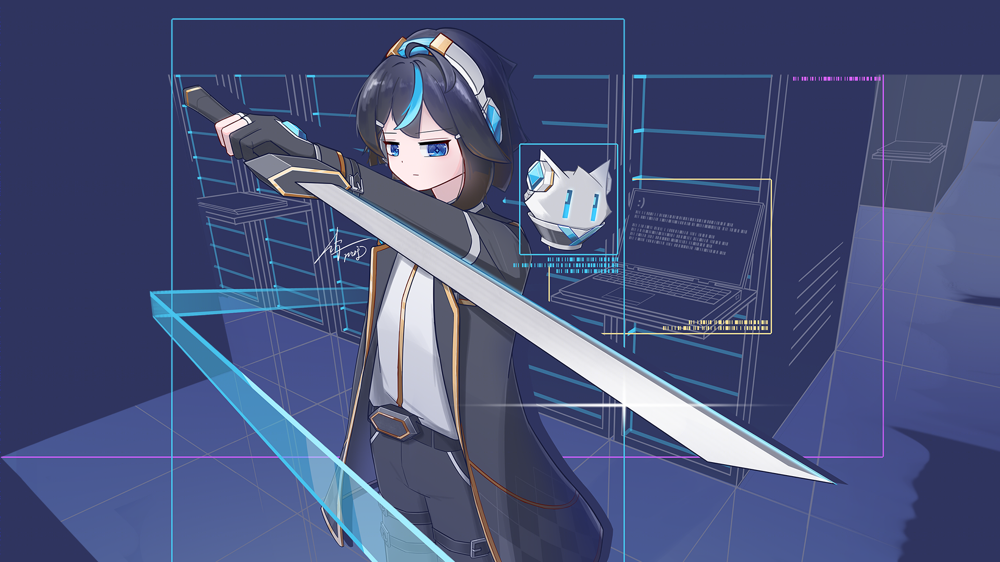
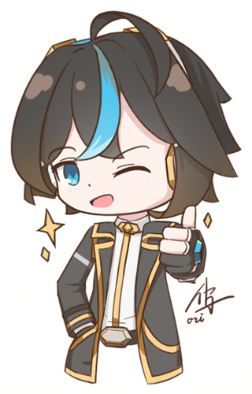
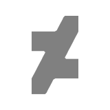
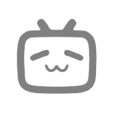



<picture>
    <source media="(prefers-color-scheme: light)" srcset="images/stickers/thumb-light.png">
    <source media="(prefers-color-scheme: dark)"  srcset="images/stickers/thumb-dark.png">
    
</picture>

- 🌐 中文 / English
- 🗣 Pronunciation: /stiːv ɕy/. You can also call me "什五 (shí wǔ, ㄕˊ ㄨˇ or ジュウゴ)".
- 👤 He/Him. Virgo. MBTI personality: ISTP.
- 🖌 I'm an amateur creator. I draw something and make video sometimes.
- 💾 Sometimes I code. Currently in production: [Quanto Series](https://stevehsudrawing.github.io/softwares.html#quanto-series)
- 🤔 I want to create more, code more and sleep more.
- 🎨 My major color: `#47c4ee`, `#3c96ff`

---

    
    
    
    
    
     
    Thanks for your visiting!

